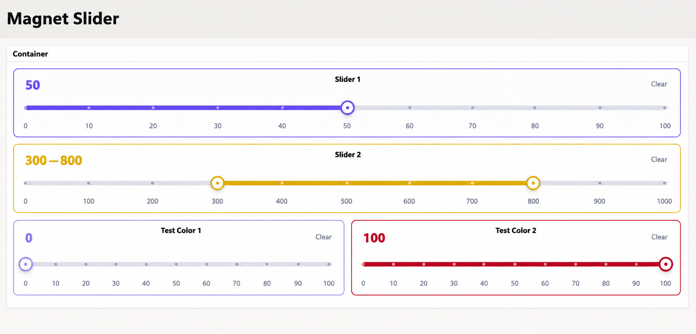

# Magnet-Slider
<p align="center">
  
</p>

# Magnet Slider

**Magnet Slider** is an Oracle APEX **item plug-in** for picking a number, or a range of two numbers, by sliding a handle that *snaps* to fixed stops. Instead of free-moving values, users can only choose from the stops you define, so what gets saved is always a valid value.

It works like a normal page item: the value is stored in session state, submitted with the page, validated on the server, and can be used in Dynamic Actions, processes and the JavaScript API.

## Features

- **Single** mode (one handle, value like `30`) and **Range** mode (two handles, value like `20:80`)
- Stops from **Minimum / Maximum / Step**, or your own list in **Custom Stops** (for example `0, 5, 10, 25, 50, 100`)
- Smooth **bounce animation** when the handle snaps to a stop
- **Accent color** picked with the color picker in Page Designer, also used for a thin border around the item
- Optional **prefix and suffix** for the displayed value (for example `$` or `%`)
- Optional **Clear** button
- Server-side validation: a value that is not an allowed stop is rejected
- Mouse, touch and **keyboard** support, with screen-reader labels
- Respects *reduced motion* settings and works in right-to-left layouts

## Requirements

Oracle APEX **26.1** or later.

## Installation

1. Download `item_type_plugin_com_cemsm_magnet_slider.sql` from the [latest release](../../releases/latest).
2. In your application, open **Shared Components → Plug-ins** and click **Import**.
3. Upload the file and complete the import.
4. On a page, create a new item and set its **Type** to **Magnet Slider**.
5. Set the options in the item's settings, save, and run the page.

## Configuration

| Attribute | Description | Default |
|---|---|---|
| Mode | `Single` (one value) or `Range` (lower and upper value) | Single |
| Minimum | Lowest selectable number | 0 |
| Maximum | Highest selectable number, must be greater than Minimum | 100 |
| Step | Distance between stops, must divide (Maximum − Minimum) exactly | 10 |
| Custom Stops | Comma-separated list of allowed numbers in increasing order. When filled in, it replaces Minimum, Maximum and Step | – |
| Prefix | Text shown before the value | – |
| Suffix | Text shown after the value | – |
| Accent | Accent color (color picker) | `#7255e7` |
| Allow Clear | Show a Clear button | Yes |

### Examples

- **Percentage:** Mode Single, Minimum 0, Maximum 100, Step 10, Suffix `%`
- **Price range:** Mode Range, Minimum 0, Maximum 500, Step 50, Prefix `$`
- **Uneven choices:** Custom Stops `1, 2, 5, 10, 25, 50, 100`

## Saved value

| Mode | Stored in the item | Example |
|---|---|---|
| Single | One number | `30` |
| Range | `lower:upper` | `20:80` |
| Nothing selected | Empty (null) | |

If the item is **Required**, an empty slider fails validation. If a saved value no longer matches the stops (for example after you change the settings), it is dropped and the user is asked to choose again.

## JavaScript API

```js
apex.item("P1_ITEM").getValue();            // "30" or "20:80"
apex.item("P1_ITEM").setValue("30");        // single
apex.item("P1_ITEM").setValue("20:80");     // range
apex.item("P1_ITEM").disable();
apex.item("P1_ITEM").enable();
```

The item fires the standard `change` event, so **Dynamic Actions on Change** work as usual.

## Keyboard

| Key | Action |
|---|---|
| Arrow keys | Move one stop |
| Page Up / Page Down | Move ten stops |
| Home / End | Jump to the first / last stop |

## Limits

- Plain numbers only (no thousand separators), up to 6 decimal places, between −1,000,000,000 and 1,000,000,000
- 2 to 1001 stops
- Many stops: only up to 11 tick labels are drawn so they stay readable, but every stop can still be selected

## License

[MIT](LICENSE) © Mohammad Saleh Moeinadini
